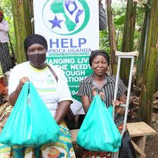
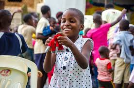
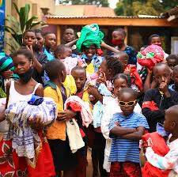

[index.html.html](https://github.com/user-attachments/files/23570533/index.html.html)
<!doctype html>
<head>
    <meta charset="UTF-8">
    <meta name="viewport" content="width=device-width, initial-scale=1.0">
    <link rel="stylesheet" href="styles.css">
    <link rel="icon" href="favicon.ico" type="image/x-icon">
     <link href="https://cdn.jsdelivr.net/npm/bootstrap@5.3.8/dist/css/bootstrap.min.css" rel="stylesheet" integrity="sha384-sRIl4kxILFvY47J16cr9ZwB07vP4J8+LH7qKQnuqkuIAvNWLzeN8tE5YBujZqJLB" crossorigin="anonymous">
    <body>
        

h

h

    <title>Aurora Global Foundation </title>
</head>
<h1 style="color: brown; text-shadow: 0ch;">Welcome to</h1>
<h1 style="color: rgb(9, 50, 236);">Aurora Global Foundation</h1>
</ul>
</section>

<section aria-labelledby="partners" class="partners">
<h2 id="partners">Partners & Funders</h2>

Aurora works with multilateral agencies, private foundations, impact investors, and local governments to co-design scalable programs. Current partners include the Global Fund for Development, SunCap Energy, the Open Learning Trust, and the Clean Water Coalition.

<!-- Placeholder logos — replace with real images when available -->

</section>

<section aria-labelledby="how-to-help" class="how-to-help">
<h2 id="how-to-help">How You Can Help</h2>

There are many ways to get involved — donate, partner, volunteer, or advocate. Aurora maintains a direct giving channel with 100% allocation transparency for specific projects. Our donation tiers are designed to make impact visible and verifiable.

<ul>
<li><strong>$25</strong> — Clean water for one household for six months.</li>
<li><strong>$100</strong> — Learning materials and teacher support for a classroom for one year.</li>
<li><strong>$500</strong> — Starter grant for a women-led microenterprise cooperative.</li>
</ul>

<a href="contact.html#donate" class="btn-primary">Donate Now</a> <a href="contact.html#volunteer" class="btn-secondary">Volunteer</a>

</section>

</main>

<footer class="site-footer" role="contentinfo">

<nav aria-label="Footer">
<ul class="footer-nav">
<li><a href="index.html.html">Home</a></li>
<li><a href="programs.html">Programs</a></li>
<li><a href="about.html">About</a></li>
<li><a href="contact.html">Contact</a></li>
</ul>
</nav>

©  Aurora Global Foundation — Registered Charity #12345678

</footer>
</body>
</html>
